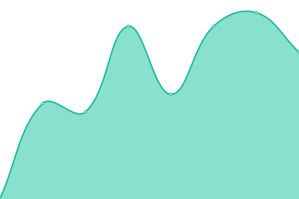

# BLANC: <!--live status--> **🟧 Partial outage**

This repository contains the open-source uptime monitor and status page for [BLANC](https://blancfashion.com), powered by [Upptime](https://github.com/upptime/upptime).

<!--start: status pages-->
<!-- This summary is generated by Upptime (https://github.com/upptime/upptime) -->
<!-- Do not edit this manually, your changes will be overwritten -->
<!-- prettier-ignore -->
| URL | Status | History | Response Time | Uptime |
| --- | ------ | ------- | ------------- | ------ |
|  [BLANC Showroom](https://blancfashion.com/) | 🟩 Up | [blanc-showroom.yml](https://github.com/BLANC-Fashion/status-page/commits/HEAD/history/blanc-showroom.yml) | 

 143ms
     
 | 

<a href="https://status.blancfashion.com/history/blanc-showroom">100.00%</a>
    

|  [Platform API v1](https://api.blancfashion.com/) | 🟩 Up | [platform-api-v1.yml](https://github.com/BLANC-Fashion/status-page/commits/HEAD/history/platform-api-v1.yml) | 

 230ms
     
 | 

<a href="https://status.blancfashion.com/history/platform-api-v1">100.00%</a>
    

|  [Platform API v2](https://new.api.blancfashion.com/) | 🟩 Up | [platform-api-v2.yml](https://github.com/BLANC-Fashion/status-page/commits/HEAD/history/platform-api-v2.yml) | 

 880ms
     
 | 

<a href="https://status.blancfashion.com/history/platform-api-v2">100.00%</a>
    

|  Automation Service | 🟩 Up | [automation-service.yml](https://github.com/BLANC-Fashion/status-page/commits/HEAD/history/automation-service.yml) | 

 431ms
     
 | 

<a href="https://status.blancfashion.com/history/automation-service">99.48%</a>
    

|  [News and Views](https://news.blancfashion.com/) | 🟥 Down | [news-and-views.yml](https://github.com/BLANC-Fashion/status-page/commits/HEAD/history/news-and-views.yml) | 

 729ms
     
 | 

<a href="https://status.blancfashion.com/history/news-and-views">94.85%</a>
    

<!--end: status pages-->

[**Visit our status website →**](https://status.blancfashion.com/)

## 📄 License

- Powered by: [Upptime](https://github.com/upptime/upptime)
- Code: [MIT](./LICENSE) © [Anand Chowdhary](https://anandchowdhary.com), supported by [Pabio](https://pabio.com)
- Data in the `./history` directory: [Open Database License](https://opendatacommons.org/licenses/odbl/1-0/)
